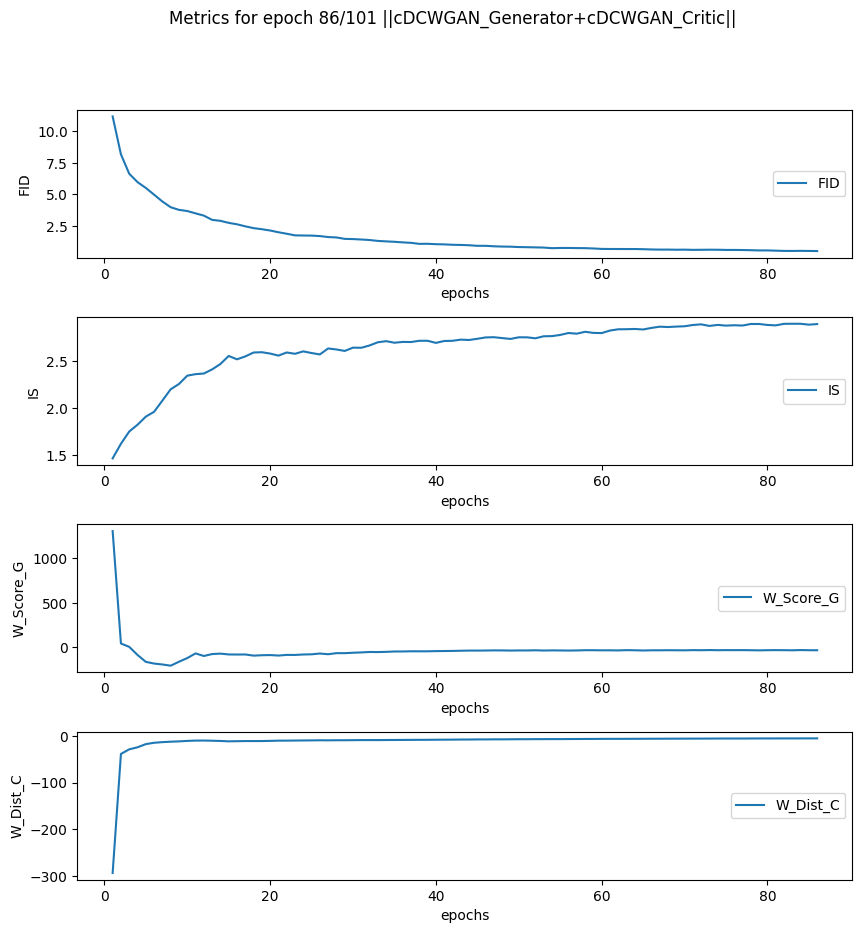
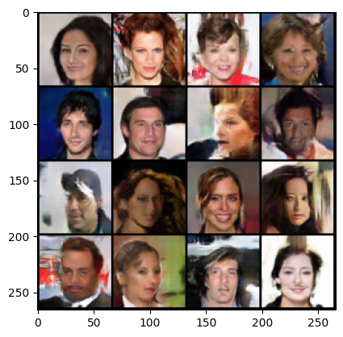
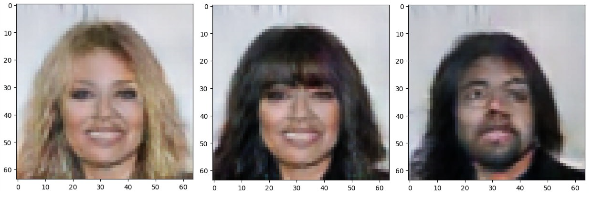

## Conditional Deep-Convolutional Wasserstein GAN

Original Paper: https://arxiv.org/abs/1701.07875

For implementation and training see `notebooks/cv-lab4*.ipnb`

For validation, Inception Score and Frechet Distance were used.

# Training

# Results

**Gallery**

**Generation with parameters**

